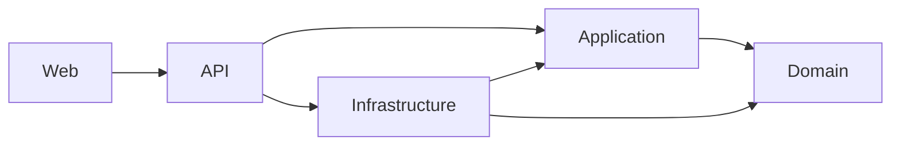
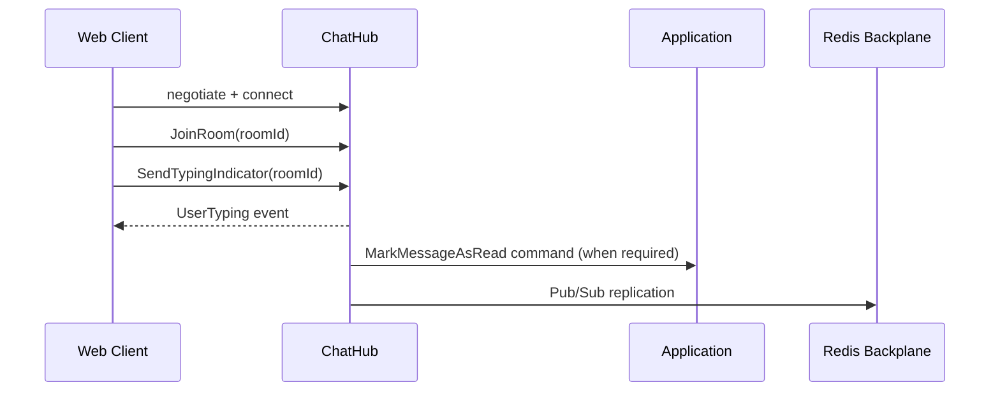

# Architecture

This document describes ChatApp system boundaries, data flows, and runtime behavior.

## 1. Architectural Goals

- Keep business rules isolated from UI and infrastructure details
- Support horizontal scaling for real-time chat workloads
- Maintain high testability and predictable change impact
- Preserve strong operational observability and debugging capabilities

## 2. Layers and Responsibilities

### Domain (`src/ChatApp.Domain`)

- Entities: `User`, `ChatRoom`, `Message`, `RefreshToken`, `UserBlock`
- Value objects: `Email`, `Username`
- Domain events: `MessageSentEvent`, `UserJoinedRoomEvent`, `UserLeftRoomEvent`
- `DomainException` for business rule violations

### Application (`src/ChatApp.Application`)

- Use-case oriented command/query handlers
- MediatR pipeline behaviors:
  - `ValidationBehavior`
  - `LoggingBehavior`
  - `PerformanceBehavior`
  - `UnhandledExceptionBehavior`
- DTO models and mapping profiles
- Interfaces abstracting infrastructure dependencies

### Infrastructure (`src/ChatApp.Infrastructure`)

- EF Core `ApplicationDbContext` and migrations
- Repository + Unit of Work implementations
- JWT token services and password hashing
- Redis-based cache service
- SMTP sender and queue-backed background email dispatch
- Refresh token cleanup background service

### API (`src/ChatApp.API`)

- REST controller endpoints
- SignalR hubs (`/hubs/chat`, `/hubs/notifications`)
- Middleware pipeline:
  - exception handling
  - security headers
  - Serilog request logging
  - CORS
  - rate limiting
  - authentication and authorization
- Health endpoints

### Web (`src/ChatApp.Web`)

- React + TypeScript application
- Route guards and auth state management
- Axios interceptors for 401/refresh flows
- SignalR client with reconnect strategy
- QA panel and multi-session diagnostics UI

## 3. Dependency Direction

Core principle: the Domain layer has no dependency on outer layers.

## 4. HTTP Request Processing Flow

## 5. Real-Time Flow

Notes:

- SignalR can receive JWT via query string (`access_token`).
- Hub methods are protected by `MessageRateLimitingHubFilter`.

## 6. Data Model Overview

Primary tables:

- `Users`
- `ChatRooms`
- `ChatRoomMembers`
- `Messages`
- `MessageReactions`
- `RefreshTokens`
- `UserBlocks`

Performance-focused indexes:

- `Messages(ChatRoomId, CreatedAtUtc)`
- `Messages(Content)` trigram index
- `Users(DisplayName)` trigram index
- `ChatRoomMembers(UserId, IsBanned, ChatRoomId)` lookup index

## 7. Cross-Cutting Policies

### Authentication and Authorization

- JWT Bearer authentication for API and hubs
- Short-lived access tokens and longer-lived refresh tokens
- Refresh tokens stored hashed

### Rate Limiting

- Auth policy: 5 requests/minute
- API policy: 100 requests/minute
- Additional memory-cache limits on critical hub methods

### Error Handling

- Validation errors: HTTP 400 + details
- Unexpected errors: HTTP 500 + generic message
- Structured logs via Serilog

## 8. Scalability Approach

- Stateless API instances can scale horizontally
- SignalR multi-instance events synchronized through Redis backplane
- Query load controlled with pagination and index discipline
- Hosted services offload email dispatch and token cleanup from request path

## 9. Known Risks and Trade-offs

- Current CORS setup is permissive and must be restricted in production
- Data protection key persistence in containers is not fully hardened
- QA panel is powerful and must remain environment-gated

## 10. Recommended Improvements

- Introduce strict CORS origin allowlists by environment
- Add read-model/caching strategy for heavy query workloads
- Consider Outbox/Inbox patterns for stronger event delivery guarantees
- Expand security headers with CSP and HSTS for production
