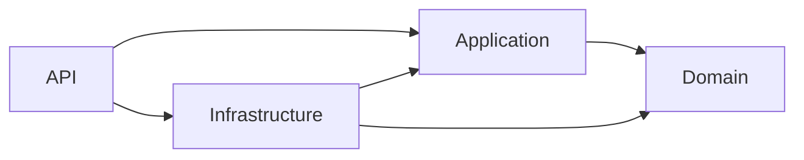
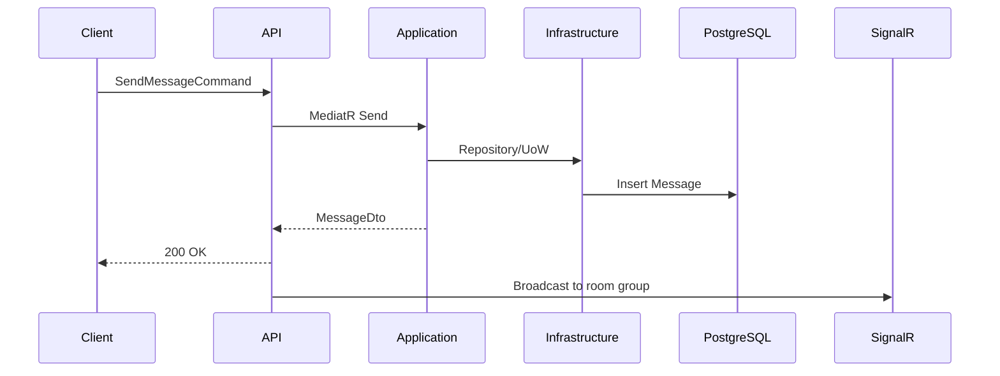

# Architecture

## System Overview

ChatApp is a layered real-time chat backend focused on maintainability and horizontal scalability.

## Layers

- Domain: Entities, value objects, domain rules, events.
- Application: CQRS handlers, validators, DTOs, interfaces.
- Infrastructure: EF Core persistence, repositories/UoW, JWT, Redis cache.
- API: Controllers, hubs, middleware, composition root.

## Dependency Flow

## Component Interaction

## Scalability

- Stateless API nodes.
- Redis backplane for SignalR scale-out.
- PostgreSQL indexes for hot paths.

## Performance

- CQRS pipeline behaviors for logging and timing.
- Message and membership indexes.
- Health checks for operational visibility.
