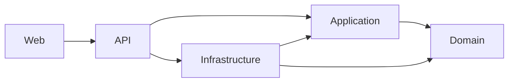
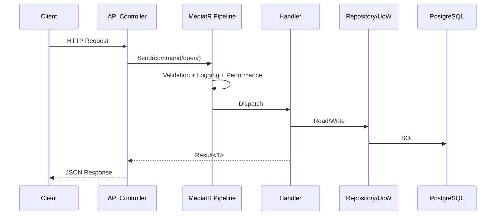
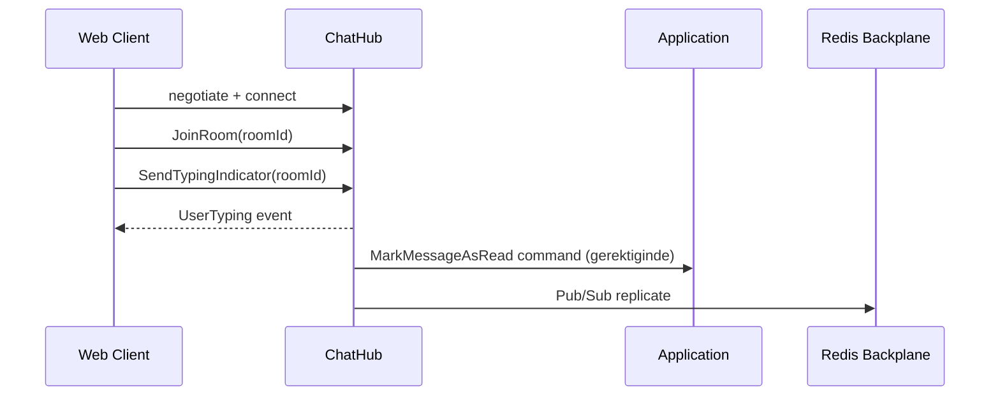

# Architecture

Bu dokuman, ChatApp sisteminin mimari sinirlarini, veri akislarini ve runtime davranisini aciklar.

## 1. Mimari Hedefler

- Is kurallarini UI ve altyapi detaylarindan izole tutmak
- Realtime chat akislarini yatay olcekte calisabilir hale getirmek
- Test edilebilir, degisiklik etkisi tahmin edilebilir bir kod tabani olusturmak
- Operasyonel gozetim ve hata ayiklama kabiliyetini yuksek tutmak

## 2. Katmanlar ve Sorumluluklar

### Domain (`src/ChatApp.Domain`)

- Entity modelleri: `User`, `ChatRoom`, `Message`, `RefreshToken`, `UserBlock`
- Value objectler: `Email`, `Username`
- Domain eventler: `MessageSentEvent`, `UserJoinedRoomEvent`, `UserLeftRoomEvent`
- Is kurali ihlallerinde `DomainException`

### Application (`src/ChatApp.Application`)

- Use-case odakli command/query handlerlari
- MediatR pipeline behaviorlari:
  - `ValidationBehavior`
  - `LoggingBehavior`
  - `PerformanceBehavior`
  - `UnhandledExceptionBehavior`
- DTO modelleri ve mapping profilleri
- Dis bagimliliklara karsi interface tanimlari

### Infrastructure (`src/ChatApp.Infrastructure`)

- EF Core `ApplicationDbContext` ve migrationlar
- Repository + Unit of Work implementasyonlari
- JWT token servisi ve password hasher
- Redis tabanli cache servisi
- SMTP e-posta gonderici ve kuyruk tabanli background dispatch
- Refresh token cleanup background service

### API (`src/ChatApp.API`)

- REST controller endpointleri
- SignalR hub endpointleri (`/hubs/chat`, `/hubs/notifications`)
- Middleware zinciri:
  - Exception handling
  - Security headers
  - Serilog request logging
  - CORS
  - Rate limiter
  - Authentication/Authorization
- Health check endpointleri

### Web (`src/ChatApp.Web`)

- React + TypeScript tabanli istemci
- Route guard ve auth state yonetimi
- Axios interceptor ile 401 refresh akisi
- SignalR client ve reconnect stratejisi
- QA paneli ve multi-session test UI

## 3. Bagimlilik Yonleri

Temel ilke: Domain katmani dis katmanlari bilmez. Is kurali, yukari katmanlardan cagrilir ama ters yonlu bagimlilik olusturmaz.

## 4. Request Isleme Akisi

## 5. Realtime Akis

Notlar:

- SignalR baglantisi JWT tokeni query string (`access_token`) ile alabilir.
- Hub metodlarinda ek bir `MessageRateLimitingHubFilter` uygulanir.

## 6. Veri Modeli Ozeti

Temel tablolar:

- `Users`
- `ChatRooms`
- `ChatRoomMembers`
- `Messages`
- `MessageReactions`
- `RefreshTokens`
- `UserBlocks`

Performans odakli noktalar:

- `Messages(ChatRoomId, CreatedAtUtc)` indeksi
- `Messages(Content)` trigram indeksi
- `Users(DisplayName)` trigram indeksi
- `ChatRoomMembers(UserId, IsBanned, ChatRoomId)` lookup odakli indeks

## 7. Cross-Cutting Politikalar

### Kimlik dogrulama ve yetkilendirme

- JWT Bearer ile API + Hub yetkilendirmesi
- Access token kisa omurlu, refresh token daha uzun omurlu
- Refresh tokenlar hashlenerek saklanir

### Rate limiting

- Auth endpoint policy: 5 istek/dakika
- API endpoint policy: 100 istek/dakika
- Hub metotlari icin ek memory-cache tabanli sinirlama

### Hata yonetimi

- Validation hatalari: HTTP 400 + detay listesi
- Beklenmeyen hatalar: HTTP 500 + genel hata mesaji
- Yapilandirilmis loglar Serilog ile tutulur

## 8. Olceklenebilirlik Yaklasimi

- API stateless olarak olceklendirilebilir
- SignalR instance'lari Redis backplane ile senkronize event dagitir
- DB tarafinda pagination ve indeks kullanimi ile kontrol edilir
- Hosted service'ler sayesinde e-posta dispatch ve token cleanup API request yolundan ayrilir

## 9. Bilinen Riskler ve Trade-offlar

- CORS policy su an genis (`SetIsOriginAllowed(_ => true)` + credentials). Uretimde daraltilmalidir.
- Container icinde data protection key persistence varsayilan durumda kalici degil.
- QA paneli guclu test fonksiyonlari saglar; ortam bazli acma/kapama disiplini zorunludur.

## 10. Mimariyi Gelistirme Onerileri

- CORS whitelist ve environment bazli policy farklastirma
- Read model agir sorgular icin projection/cache stratejisi
- Outbox/Inbox ile event teslim garantisinin guclendirilmesi
- Security header setinin CSP ve HSTS ile genisletilmesi
